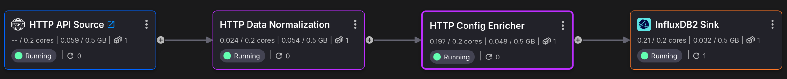
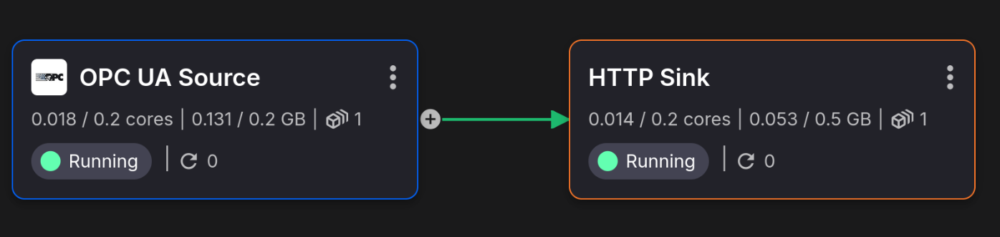
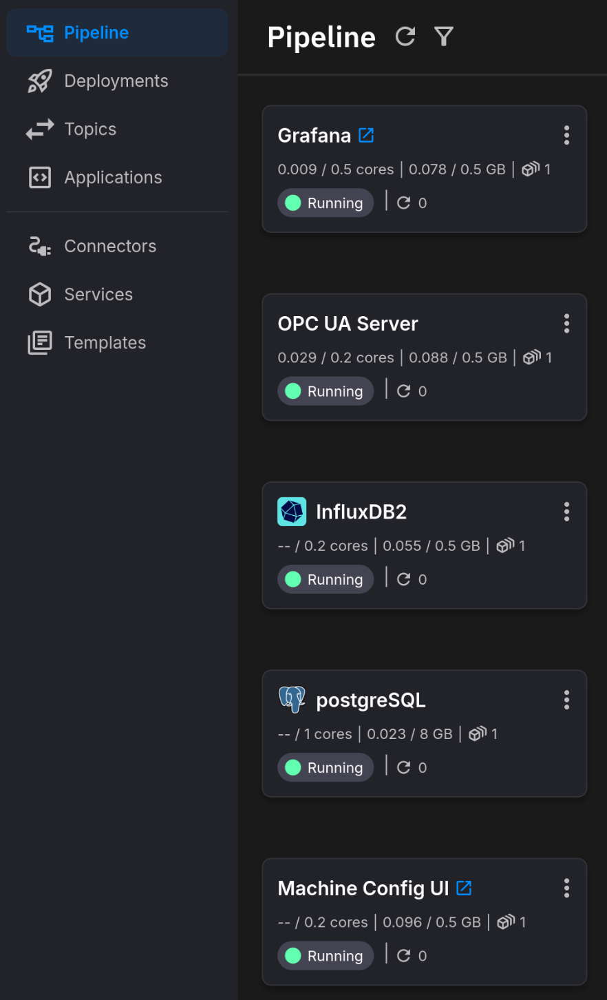
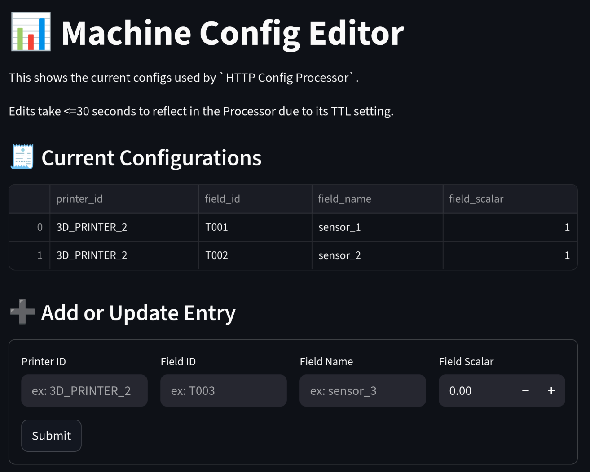
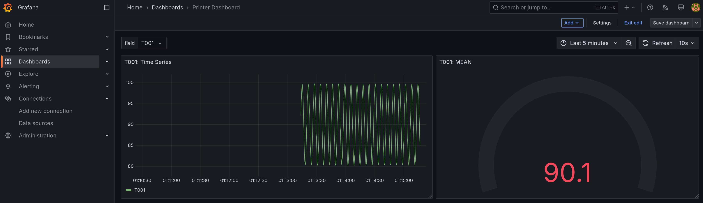

# HTTP Ingestion with DB Configuration Project Template

This example project `demonstrates` how to receive data from an HTTP endpoint, 
do some normalizations followed by applying a configuration set by a frontend
application, and then publish the augmented data to an InfluxDB2 database.

It also includes visualization/dashboard examples using Grafana (which queries InfluxDB2).


## Project Architecture

### HTTP Ingestion and Processing Pipeline

This is the HTTP-based data ingestion and processing portion of the project:




### Mock Data Source

These applications are only meant to simulate an external data source:




### Standalone Services

These are standalone services, including an InfluxDB2 instance.




## Configuration

There are various things that can be tweaked, like the name of the InfluxDB database. 
However, everything in this template has predefined values except secrets, which will
require defining upon deployment of this project.

### Required Secrets

These will be requested once this project template is deployed:

- **influxdb_admin_token**
- **influxdb_admin_password**
- **http_auth_token**


## Data Operations Overview

### Event Structure
```json
{
  "srv_ts": 1753717885782747100,
  "connector_ts": 1753717885792584200,
  "type": "Double",
  "val": 198.54935414815827,
  "param": "T002",
  "machine": "3D_PRINTER_2"
}
```

The HTTP source will receive IoT events from a sensor (`machine`) that each contain a 
value (`val`) for a given measurement (`param`), along with the timestamp it was 
generated at (`srv_ts`).

In total, there are 2 different parameters: `T001` and `T002`.

In this example, there is only 1 machine (`3D_PRINTER_2`).


### Normalizing Events

We will normalize these events so that each parameter is no longer an individual event.

Instead, we aggregate across all parameters so that for a given machine, we get the 
average of each parameter across 1 second (determined by the event timestamp, `srv_ts`).

This will result in a new outgoing aggregate event:

```json
{
  "T001": 97.20,
  "machine": "3D_PRINTER_2",
  "T002": 194.41,
  "timestamp": "2025-07-28 15:52:51.600000"
}
```

This aggregation is done using a Quix Streams `tumbling_window` operation, found in the
`HTTP Data Normalization` application.


### Applying Printer Config

Using the `Configuration Frontend`, you can set what values will be used by the 
`HTTP Config Processor`.

By default, these will be the settings:



They can be changed by going to the frontend and adjusting the values.

The `HTTP Config Processor` will use these to convert the names of the fields using the
mapping specified here, and also apply the scalar to the given respective field.


### InfluxDB2 Data

These events are then pushed to InfluxDB2 to database `my_bucket` under measurement 
`printers` (with `machine` as a tag).


**my_bucket**: **printers**

| sensor_1 | sensor_2 | timestamp (_time)            | machine (_tag)   |
|----------|----------|------------------------------|------------------|
| 97.20    | 194.41   | "2025-07-28 15:52:51.600000" | "3D_PRINTER_2"   |

> Note: notice that the column names reflect what is specified in the config!

## Grafana

There is a simple Grafana dashboard included in the project.

You can select which column to view (`sensor_1`, `sensor_2`) for the given graphs.

There is a simple Time Series graph and mean value gauge, each based on the 
selected time window.

