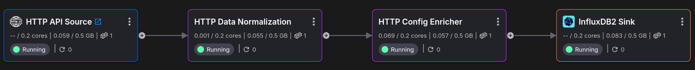

# HTTP Ingestion with DB Configuration Project Template

This example project demonstrates how to receive data from an HTTP endpoint, 
do some normalizations, followed by applying a DB-based Configuration set through a UI,
and then publish the augmented data to an InfluxDB2 database.

It also includes visualization/dashboard examples using Grafana (which queries InfluxDB2).


## Running the Template

### Syncing
Once the project is set up, an initial sync must be performed to deploy everything. 

Essentially, the cloud state must sync up to the current state of the new repository 
which now has a cloned version of the template.


Syncing is always a manually initiated operation that's available whenever updates 
to the code (underlying repository) happen.

### Setting Secrets

>**WARNING**: These secrets exist to act as an authentication layer since 
> ***some services are openly accessible to the entire internet***;
> as such: **DO NOT PICK WEAK PASSWORDS**.

Upon syncing, there will be a prompt to set up some project-level secrets (passwords). 
Simply choose a secure password for each.


Note that once set, you cannot view the values again. This largely only matters for 
services like Grafana, where users will be required to directly enter them for access to 
the UI, so make sure you save the value somewhere. 

Other services will reference these secrets directly in their project deployment 
configurations, so they do not need to be manually entered.

### Service Startup Delays and Application Restarts

Upon first sync, it is normal that some applications may restart/error a few times while 
some of its dependencies are still starting up.

Applications should not need to restart more than 3-5 times before everything is
up and running.


## Project Architecture

### HTTP Ingestion and Processing Pipeline

This is the HTTP-based data ingestion and processing portion of the project:




### Mock Data Source

These applications are only meant to simulate an external data source:


### Standalone Services

These are standalone services, including an InfluxDB2 instance.


## Configuration

There are various things that can be tweaked, like the name of the InfluxDB database. 
Some will be configurable via environment, and others will require adjusting code as
desired.

Regardless, everything in this template has predefined values except secrets, which will
require defining upon deployment of this project (see [setting secrets](#setting-secrets)).

### Using the Printer Configuration UI

To learn how to adjust a printer config via the Printer Config UI, see [applying a printer config](#applying-a-printer-config).


## Data Operations Overview

### Event Structure
```json
{
  "srv_ts": 1753717885782747100,
  "connector_ts": 1753717885792584200,
  "type": "Double",
  "val": 198.54935414815827,
  "param": "T002",
  "machine": "3D_PRINTER_2"
}
```

The HTTP source will receive IoT events from a sensor (`machine`) that each contain a 
value (`val`) for a given measurement (`param`), along with the timestamp it was 
generated at (`srv_ts`).

In total, there are 2 different parameters: `T001` and `T002`.

In this example, there is only 1 machine (`3D_PRINTER_2`).


### Normalizing Events

We will normalize these events so that each parameter is no longer an individual event.

Instead, we aggregate across all parameters so that for a given machine, we get the 
average of each parameter across 1 second (determined by the event timestamp, `srv_ts`).

This will result in a new outgoing aggregate event:

```json
{
  "T001": 97.20,
  "machine": "3D_PRINTER_2",
  "T002": 194.41,
  "timestamp": "2025-07-28 15:52:51.600000"
}
```

This aggregation is done using a Quix Streams `tumbling_window` operation, found in the
`HTTP Data Normalization` application.


### Applying a Printer Config

Using the `Machine Config UI` service, you can set what values will be used by the 
`HTTP Config Processor`.

#### Accessing the Machine Config UI

Click on the blue link to authenticate with the UI.


The token should be what `config_ui_auth_token` was set to during the initial template sync.


#### Using the Machine Config UI

By default, these will be the settings:


They can be added or changed by going to the UI and adjusting the values.

The `HTTP Config Processor` will use these to convert the names of the fields using the
mapping specified here, and also apply the scalar to the given respective field.


### InfluxDB2 Data

These events are then pushed to InfluxDB2 to database `my_bucket` under measurement 
`printers` (with `machine` as a tag).


**my_bucket**: **printers**

| sensor_1 | sensor_2 | timestamp (_time)            | machine (_tag)   |
|----------|----------|------------------------------|------------------|
| 97.20    | 194.41   | "2025-07-28 15:52:51.600000" | "3D_PRINTER_2"   |

> Note: notice that the column names reflect what is specified in the config!


## Grafana

There is a simple Grafana dashboard included in the project.

### Accessing Grafana

Click on the blue link to log in to Grafana.


- **username**: `admin`
- **password**: whatever value `grafana_password` was set to when
  first setting up the template.


### Using Grafana

There is a simple Time Series graph and mean value gauge, each based on the 
selected time window.


You can select which column to view (`sensor_1`, `sensor_2`) for the given graphs.
